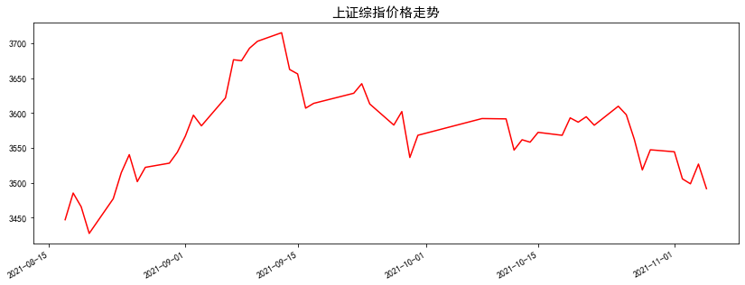
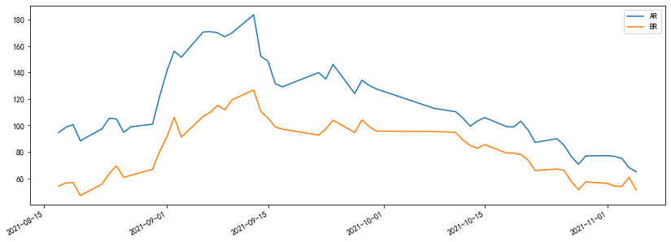
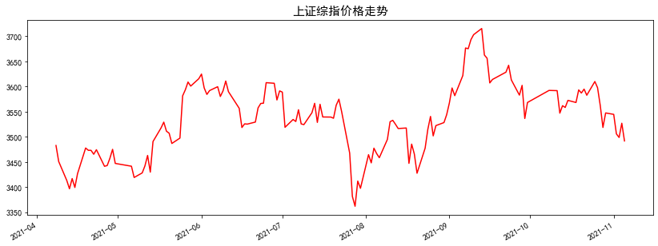
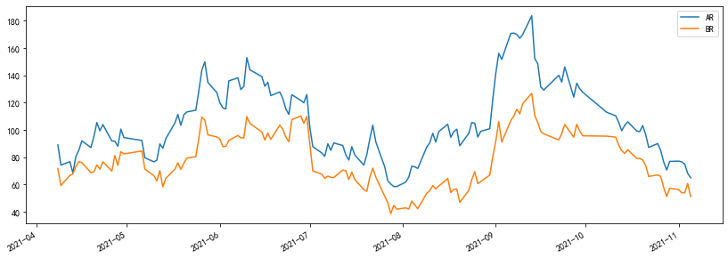
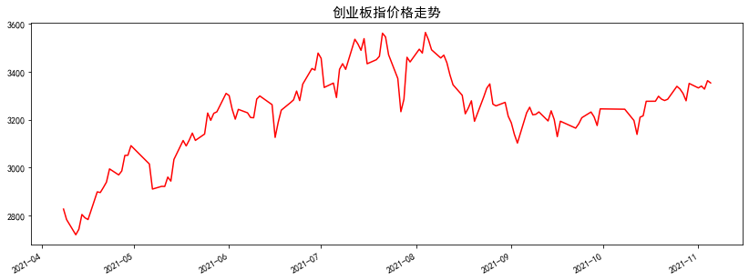
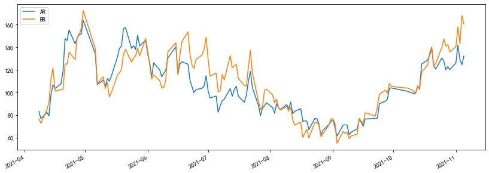
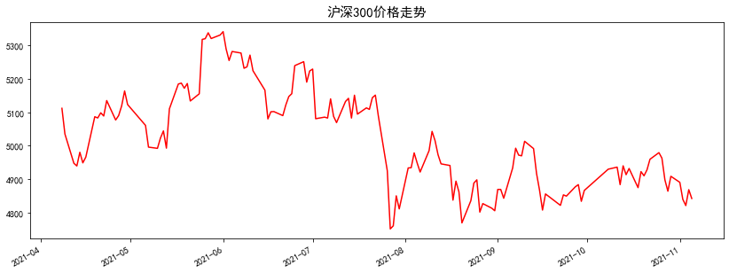
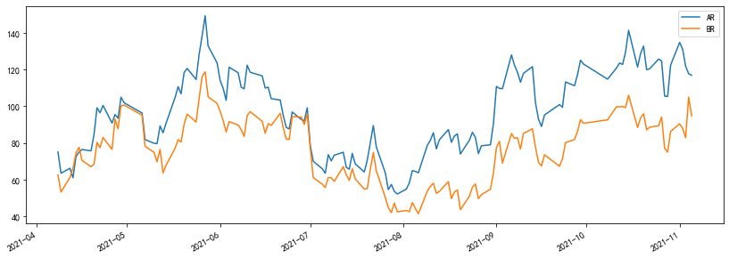
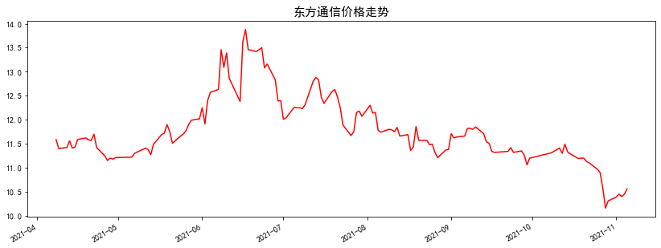
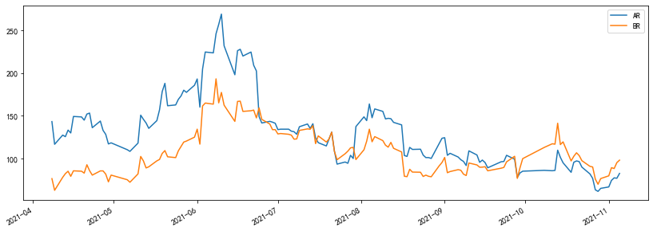

股票投资，难免有些地方需要靠运气，但长期而言，好运、倒霉会相抵，想要持续的成功，必须靠技能和运用良好的原则。——菲利普·费舍

### 前言
是什么影响着每天股价的变动？是什么决定指数在多少点位？为什么当股票价格稳定在某个区域的时候，会突然发生逆转？《非理性繁荣》作者希勒认为，股票市场的价格并不完全由基本面决定，股票市场的大幅上涨与公众的过度乐观存在显著的相关性。市场的极端行情更多地应该归结为交易者心理的自然反馈与纠正过程，而不是某些完全从外部作用于市场的事件。大部分交易者在市场处于顶部时表现最乐观，而在市场处于底部时最悲观。

关于牛熊的回忆见之前推文：【Python金融量化】A股沉浮启示录。投资者情绪(Investor Sentiment)，是行为金融学解释市场异象的主要理论基础之一。投资者情绪可简单理解为投资者对金融资产的一种乐观和悲观的看法或是投机倾向。对投资者情绪的刻画主要有两类指标：一是直接调查投资者的情绪，包括问卷调查，多空调查等主观因素指标；二是采用市场交易数据进行统计处理，即客观或间接指标。目前国内对市场情绪的量化也主要采用第二种方法，如中信证券对五类市场指标进行主成分分析来构建投资者情绪，具体包括：(1)市场整体类指标：整体市盈率、市净率、换手率；(2)市场结构类指标：上涨家数比下跌家数、小盘股相对大盘股的超额收益率等；(3)IPO系列指标：股票首发上市家数、新股上市首日涨幅；(4)封闭式基金折价率；(5)资金流动指标：A股账户净增加数。

投资者情绪的刻画指标多种多样，各有优劣，本文主要以技术分析常用的情绪指标ARBR为例，使用Python进行计算和可视化分析，为量化择时策略奠定基础。

### 情绪指标 ARBR
情绪指标，简称 ARBR 或 BRAR，由人气指标（AR）和意愿指标（BR）构成。 AR 和 BR 都是对通过对历史股价走势的分析，反映市场当前情况下多空双方的力量强弱对比，推断市场交易情绪，从而对趋势的形成与反转作出预判。

AR刻画的是市场交易人气，人气越旺，股价越高，而股价攀升带来的赚钱效应又会不断带动人气上升，但是物极必反。当AR值升高至一定限度时，代表能量已经消耗殆尽，缺乏推升力道的股价，出现反转概率增大。BR反映的是市场交易意愿，以“反市场心理”为基础，当市场人气狂热时卖出，人气悲观时买进。

### BRAR 指标计算

AR指标是通过比较某个周期内开盘价与最高、最低价，来反映市场买卖人气。计算公式为：**N日AR=(N日内（H－O）之和）/(N日内（O－L）之和)\*100**。

BR指标是通过比较一段周期内收盘价在该周期价格波动中的地位，来反映市场买卖意愿程度。计算公式为：**N日BR=（N日内（H－YC）之和）/N日内（YC－L）之和）\*100**。

其中，O 为当日开盘价，H 为当日最高价，L 为当日最低价，YC 为前一交易日的收盘价，N 为设定的时间参数，一般原始参数日设定为 **26** 日，计算周期可以根据自己的经验或回测结果进行修正。

### 应用法则

双方的分界线是 **100**，100 以上是多方优势，100 以下是空方优势。

**买入信号：**

BR通常运行在AR上方，一旦BR跌破AR并在AR之下运行时，表明市场开始筑底，视为买进信号；BR<40,AR<60: 空方力量较强，但随时可能反转上涨，考虑买进。

**卖出信号：**
BR>400,AR>180，多方力量极强，但随时可能反转下跌，考虑卖出；BR快速上升，AR并未上升而是小幅下降或横盘，视为卖出信号。

**背离信号：**
AR、BR指标的曲线走势与[股价K线图](https://www.zhihu.com/search?q=股价K线图&search_source=Entity&hybrid_search_source=Entity&hybrid_search_extra={"sourceType"%3A"article"%2C"sourceId"%3A61488013})上的走势正好相反。

**顶背离：**
当股价K线图上的股票走势一峰比一峰高，股价一直向上涨，而AR、BR指标图上的走势却一峰比一峰低，说明出现顶背离，股价短期内将高位反转，是比较强烈的卖出信号。

**底背离：**
当股价K线图上的股票走势一底比一底低，股价一直向下跌，而AR、BR指标图上的走势却一底比一底高，说明出现底背离，股价短期内将低位反转，是比较强烈的买入信号。

BRAR指标的讯号不如其他指标明确，许多关键点必须靠个人的领悟及[自由心证](https://www.zhihu.com/search?q=自由心证&search_source=Entity&hybrid_search_source=Entity&hybrid_search_extra={"sourceType"%3A"article"%2C"sourceId"%3A61488013})，并且不同交易市场，BRAR高低档数据皆不尽相同。

### Python代码实现

下面主要给出[上证综指](https://www.zhihu.com/search?q=上证综指&search_source=Entity&hybrid_search_source=Entity&hybrid_search_extra={"sourceType"%3A"article"%2C"sourceId"%3A61488013})、创业板指、沪深300和东方通信的价格及其ARBR指标[250日曲线](https://www.zhihu.com/search?q=250日曲线&search_source=Entity&hybrid_search_source=Entity&hybrid_search_extra={"sourceType"%3A"article"%2C"sourceId"%3A61488013})走势。对于这些图的分析留待大家结合上述应用法则作进一步分析。其中，近期指数的ARBR指标与价格走势的背离值得大家关注。





















```python
#先引入后面可能用到的包（package）
import pandas as pd  
import numpy as np
import matplotlib.pyplot as plt
import tushare as ts
import talib as ta
%matplotlib inline   

#正常显示画图时出现的中文和负号
from pylab import mpl
mpl.rcParams['font.sans-serif']=['SimHei']
mpl.rcParams['axes.unicode_minus']=False

#引入TA-Lib库
import talib as ta

#设置token
token='输入你的token'
pro=ts.pro_api(token)

index={'上证综指': '000001.SH','深证成指': '399001.SZ',
        '沪深300': '000300.SH','创业板指': '399006.SZ',
        '上证50': '000016.SH','中证500': '000905.SH',
        '中小板指': '399005.SZ','上证180': '000010.SH'}

#获取当前交易的股票代码和名称
def get_code():
    df = pro.stock_basic(exchange='', list_status='L')
    codes=df.ts_code.values
    names=df.name.values
    stock=dict(zip(names,codes))
    stocks=dict(stock,**index)
    return stocks

#默认设定时间周期为当前时间往前推120个交易日
#日期可以根据需要自己改动
def get_data(code,n=120):
    from datetime import datetime,timedelta
    t=datetime.now()
    t0=t-timedelta(n)
    start=t0.strftime('%Y%m%d')
    end=t.strftime('%Y%m%d')
    #如果代码在字典index里，则取的是指数数据
    if code in index.values():
        df=pro.index_daily(ts_code=code,start_date=start, end_date=end)
    #否则取的是个股数据
    else:
        df=pro.daily(ts_code=code, start_date=start, end_date=end)
    #将交易日期设置为索引值
    df.index=pd.to_datetime(df.trade_date)
    df=df.sort_index()
    #计算收益率
    return df

#计算AR、BR指标
def arbr(stock,n=120):
    code=get_code()[stock]
    df=get_data(code,n)[['open','high','low','close']]
    df['HO']=df.high-df.open
    df['OL']=df.open-df.low
    df['HCY']=df.high-df.close.shift(1)
    df['CYL']=df.close.shift(1)-df.low
    #计算AR、BR指标
    df['AR']=ta.SUM(df.HO, timeperiod=26)/ta.SUM(df.OL, timeperiod=26)*100
    df['BR']=ta.SUM(df.HCY, timeperiod=26)/ta.SUM(df.CYL, timeperiod=26)*100
    return df[['close','AR','BR']].dropna()

#对价格和ARBR进行可视化
def plot_arbr(stock,n=120): 
    df=arbr(stock,n)
    df['close'].plot(color='r',figsize=(14,5))
    plt.xlabel('')
    plt.title(stock+'价格走势',fontsize=15)
    df[['AR','BR']].plot(figsize=(14,5))
    plt.xlabel('')
    plt.show()

plot_arbr('上证综指')
plot_arbr('上证综指',n=250)
plot_arbr('创业板指',n=250)
plot_arbr('沪深300',n=250)
plot_arbr('东方通信',n=250)
```

### 结语

股票市场上，随着多空双方的较量，股价会向上或向下偏离这一平衡价位区，**股价偏离得越大，说明力量越大，偏离得越小，说明力量越小**。因此。利用股票各种价格之间的关系，找到这个平衡价位区，对研判多空力量的变化起着重要的作用。而ARBR指标就是根据股票的开盘价、收盘价、最高价和最低价之间的关系来分析多空力量的对比，预测股价的未来走势。ARBR指标计算简单，容易理解，但是使用起来并非容易，需要深厚的实盘交易经验才能作出准确判断。另外，**ARBR指标也存在一定的局限性，如只利用了历史价格信息**，而忽略了成交量的重要性。